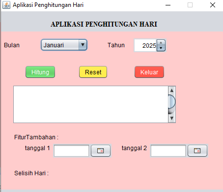
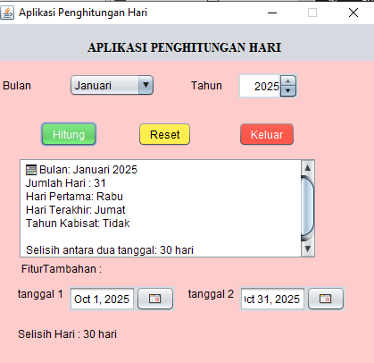

# AplikasiPenghitunganHari
Tugas 4 - Ita Khairati 2310010219

# 🗓️ Aplikasi Penghitungan Hari
Tugas 4 - Ita Khairati 2310010219

---

## 💻 Proyek Akhir Pemrograman Berbasis Objek 1

Proyek ini merupakan aplikasi berbasis **Java GUI (JFrame Form)** yang berfungsi untuk **menghitung jumlah hari dalam suatu bulan**, serta menampilkan **hari pertama, hari terakhir, dan tahun kabisat**.  
Selain itu, aplikasi ini juga memiliki **fitur tambahan untuk menghitung selisih hari antara dua tanggal** menggunakan komponen **JDateChooser** dari *Toedter Calendar*.

Aplikasi dibuat menggunakan **NetBeans IDE**, dengan penerapan konsep **Pemrograman Berorientasi Objek (OOP)**.

---

## 📘 Deskripsi

Fungsi utama aplikasi ini adalah:
- Menentukan jumlah hari pada bulan dan tahun tertentu.
- Menampilkan hari pertama dan terakhir dari bulan yang dipilih.
- Menentukan apakah tahun tersebut termasuk **tahun kabisat**.
- Menghitung **selisih hari antara dua tanggal berbeda** (fitur tambahan).

Aplikasi menerapkan konsep-konsep OOP berikut:
- Class dan Object  
- Atribut dan Method  
- Constructor  
- Encapsulation  
- Event Handling  
- GUI Programming (Swing)  
- Polymorphism (melalui event listener / lambda expression)

---

## ⚙️ Penjelasan Kode

### 1️⃣ Class
```java
public class PenghitungHariForm extends javax.swing.JFrame { ... }
```
Class ini merupakan turunan dari `JFrame` untuk membuat tampilan antarmuka pengguna (GUI).

---

### 2️⃣ Object
Object otomatis dibuat ketika program dijalankan:
```java
new PenghitungHariForm().setVisible(true);
```

---

### 3️⃣ Atribut
Atribut digunakan untuk menyimpan komponen GUI dan data:
```java
private javax.swing.JButton btnHitung, btnReset, btnKeluar;
private javax.swing.JComboBox<String> cmbBulan;
private com.toedter.calendar.JYearChooser spnTahun;
private com.toedter.calendar.JDateChooser cal1, cal2;
private javax.swing.JTextArea txtHasil;
private javax.swing.JLabel lblSelisih;
```

---

### 4️⃣ Constructor
Berfungsi untuk inisialisasi awal tampilan dan pengaturan dasar.
```java
public PenghitungHariForm() {
    initComponents();
    setTitle("Aplikasi Penghitungan Hari");
    setLocationRelativeTo(null);
    setResizable(false);
    spnTahun.setValue(LocalDate.now().getYear());
}
```

---

### 5️⃣ Mutator (Setter)
Mengatur tampilan dan properti komponen:
```java
btnHitung.setBackground(new Color(76,175,80));  // Hijau
btnReset.setBackground(new Color(255,235,59));  // Kuning
btnKeluar.setBackground(new Color(244,67,54));  // Merah
```

---

### 6️⃣ Accessor (Getter)
Mengambil nilai dari input pengguna:
```java
int tahun = spnTahun.getYear();
int bulan = cmbBulan.getSelectedIndex() + 1;
```

---

### 7️⃣ Encapsulation
Seluruh komponen GUI bersifat **private**, hanya diakses lewat method di dalam class `PenghitungHariForm`.

---

### 8️⃣ Inheritance
Aplikasi mewarisi sifat dari `JFrame`:
```java
public class PenghitungHariForm extends javax.swing.JFrame { ... }
```

---

### 9️⃣ Polymorphism (Event Handling)
Menggunakan lambda expression untuk aksi tombol:
```java
btnHitung.addActionListener(e -> hitungHari());
```

---

### 🔟 Seleksi (Percabangan)
Digunakan untuk memeriksa tahun kabisat dan validasi input:
```java
boolean kabisat = Year.isLeap(tahun);
if (kabisat) {
    txtHasil.append("\nTahun ini adalah tahun kabisat!");
}
```

---

### 11️⃣ Perulangan  
Tidak eksplisit menggunakan `for`, tetapi `addHoverEffect()` menggunakan event listener yang terus aktif selama aplikasi berjalan.

---

### 12️⃣ Input & Output
Input melalui **ComboBox**, **JYearChooser**, dan **JDateChooser**.  
Output ditampilkan di **TextArea (`txtHasil`)** dan **Label (`lblSelisih`)**.

---

### 13️⃣ Error Handling
Mencegah input kosong atau tidak valid:
```java
try {
    // Logika perhitungan
} catch (Exception e) {
    JOptionPane.showMessageDialog(this, 
        "Masukkan data dengan benar!", 
        "Kesalahan", 
        JOptionPane.ERROR_MESSAGE);
}
```

---

### 14️⃣ Fitur Tambahan
Menghitung selisih antara dua tanggal menggunakan `ChronoUnit.DAYS.between()`:
```java
long selisih = ChronoUnit.DAYS.between(tgl1, tgl2);
lblSelisih.setText("Selisih Hari : " + Math.abs(selisih) + " hari");
```

---

### 15️⃣ Tampilan & Warna Tombol
Warna tombol dibedakan agar mudah dikenali:
| Tombol | Warna | Fungsi |
|:--|:--|:--|
| **Hitung** | Hijau | Menghitung jumlah hari |
| **Reset** | Kuning | Mengosongkan form |
| **Keluar** | Merah | Menutup aplikasi |

---

## 🎨 Desain GUI

<div style="display:flex; gap:20px;">


</div>

---

## 🧠 Konsep PBO yang Diterapkan
| Konsep | Implementasi |
|:--|:--|
| Class & Object | `PenghitungHariForm` sebagai class utama |
| Atribut & Method | `txtHasil`, `btnHitung`, `hitungHari()` |
| Constructor | `PenghitungHariForm()` untuk inisialisasi GUI |
| Encapsulation | Semua atribut `private` |
| Inheritance | Turunan dari `javax.swing.JFrame` |
| Polymorphism | Event listener tombol menggunakan lambda |
| Event Handling | Tombol Hitung, Reset, dan Keluar |
| Error Handling | Menangani input kosong dan invalid |
| GUI Programming | Menggunakan Swing dan Toedter Calendar |

---

## 👩‍💻 Identitas Pembuat
**Nama:** Ita Khairati  
**NPM:** 2310010219  
**Kelas:** 4BNR_PBO1  
**Judul Proyek:** *Aplikasi Penghitungan Hari (Java GUI)*  
**Bahasa Pemrograman:** Java (Swing, NetBeans)  
